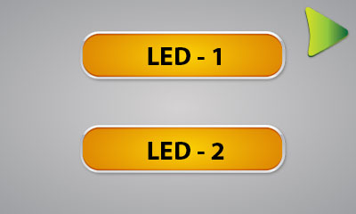

### Nextion Dosyalar

Arduino' da kullanılan kod nexTest isimli klasörün altında bulunmaktadır.

LCD' dosyaları ise diğer klasör altında "*.jpg" ve "*.psd" olarak ayrı ayrı verilmiştir.

PSD dosyasının içerisinde arayüzde kullanılan bütün reismler mevcuttur. Görünmesi istenen dışındakiler gizlenerek "*.jpg" resimler ayrı ayrı kayıt edilmiştir.

Nextion' a yüklenecek arayüzün hazırı "nexTest.HMI" isimli olarak lcd dosyalarının içerisinde mevcuttur.

